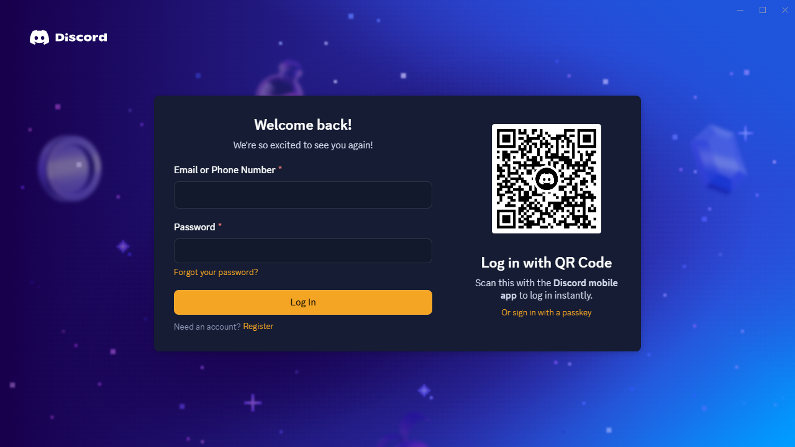
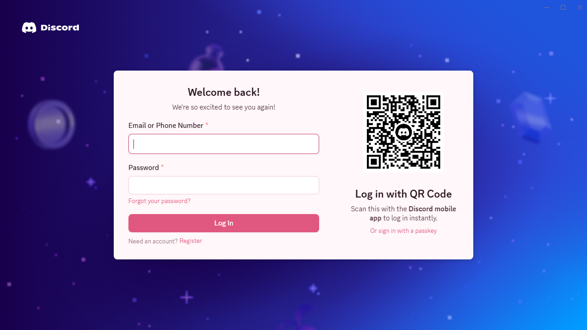

# Bazinga 

[](https://github.com/bliper2/Bazinga/releases/latest)
[](https://github.com/bliper2/Bazinga/actions/workflows/test.yml)
[](LICENSE)

Bazinga is a custom Discord desktop client for Windows, macOS and Linux. It loads Discord's web client in its own
Electron shell with [Equicord](https://github.com/Equicord/Equicord) built in and enabled by default, so you do not
need to patch the official Discord app.

Bazinga is a fork of [Equibop](https://github.com/Equicord/Equibop), which is a fork of
[Vesktop](https://github.com/Vencord/Vesktop). See [CREDITS.md](CREDITS.md).

> [!WARNING]
> Client modifications are against Discord's Terms of Service. Discord has not been known to ban for them, but you use
> Bazinga at your own risk.

## Download

Get the latest version from the [Releases page](https://github.com/bliper2/Bazinga/releases/latest):

| System  | File                                                                    |
| ------- | ----------------------------------------------------------------------- |
| Windows | `Bazinga-Setup-x.y.z-x64.exe` or `-arm64.exe` (installer), or `Bazinga-x.y.z-win.zip` (portable) |
| macOS   | `Bazinga-x.y.z-universal.dmg`                                           |
| Linux   | `.AppImage`, `.deb`, `.rpm` or `.tar.gz`                                |

Builds are not code-signed yet. On Windows, SmartScreen shows "Windows protected your PC": click **More info**, then
**Run anyway**. On macOS, right-click the app and choose **Open** the first time.

Bazinga updates itself when a new release is published. See [CHANGELOG.md](CHANGELOG.md) for what changed.

<p align="center">
  
  
</p>

## Features

**The app**

- Equicord preinstalled, plus 63 Bazinga plugins and 16 themes by orgeco (full list: [docs/PLUGINS.md](docs/PLUGINS.md)).
  Search the Plugins page for "bazinga" to list the plugins in the app.
- Discord Stable, PTB and Canary. Pick one on first launch or under **Settings → Bazinga Settings → Discord Branch**.
  Switching reloads the client right away. Each branch keeps its own login.
- **Profiles:** run several accounts side by side, each with its own login and settings
  (`--profile name`, or Settings → Profiles).
- **Safe mode** (`--safe-mode`): starts with every plugin and theme off and saves nothing, for finding out what
  breaks Discord. It starts by itself after three starts in a row that failed.
- **Reload client** from the tray, Ctrl+R and F5, and automatically after turning on a plugin that needs it
  (AutoReload plugin).
- **Performance:** presets, a low-end mode, and Discord's analytics and crash reports blocked before they leave your
  computer. See Settings → Bazinga Settings → Performance.
- Global shortcuts to show or hide the window and to mute.
- **Backup:** export and import all settings, Equicord plugins, QuickCSS and themes as one file, optionally
  encrypted with a password.
- Updates through GitHub Releases. Equicord and the Bazinga plugins update on their own from **Settings → Equicord →
  Updater**, without reinstalling the app. The installer includes an Equicord build, so the first launch works
  offline.
- Everything from Equibop: Linux screen share with audio, Wayland, arRPC, tray customization.

**Plugin highlights**

| Area | Plugins |
| ---- | ------- |
| Privacy and safety | LinkGuard, SecretLeakGuard, AttachmentScanner, ExifStripWarning, ImpersonationAlert, InviteInspector, ShortenerExpander, QRCodeReader, AccountAgeBadge, MassMentionShield, ScreenshotMode, BlockLog |
| Chat and reading | Readability, MathRender, MermaidRender, JsonPrettify, CsvTablePreview, RegexTester, CollapseLong, SpamCollapse, ZalgoFilter, Censor, HighlightWords, ReadingTime, ScriptBadge, CopyAsMarkdown, ReplyChainViewer, SnippetLibrary |
| Organisation | BookmarkTags, MessageTodos, Reminders, BirthdayReminders, ChannelNotes, ScratchPad, DraftCenter, PinSearch, ColorLabels, WorkspaceProfiles, RecentChannels, FocusSessions, QuietHours, UsageStats, CalendarEvents |
| Media | ChannelGallery, UploadShrink, ImageColorPicker, ImageCompare, GifFrameViewer, SvgPreview |
| Accessibility | ColorBlindModes, HighContrastFocus, LiveRegionMessages, ReadAloud, Readability |
| Themes | BetterDiscordThemes (all 114 BetterDiscord store themes), ThemeStudio, ThemeScheduler |
| Performance and tools | LowEndMode, PerfOverlay, AutoReload, WorldClock, EmojiUsageStats, MarkdownCheatsheet, ChannelStats |

### Themes by orgeco

Bazinga ships 16 themes made by orgeco. They appear under **Settings → Themes** after the first launch: dark
(Bazinga Midnight, Neon, Mocha, Forest, Ocean, Sunset, Crimson, Gold, AMOLED, Halloween, Winter) and light (Sakura,
Arctic, Lavender, Spring, Summer). They are defined in [`src/main/bundledThemes.ts`](src/main/bundledThemes.ts) and
written to the themes folder on startup. A theme file is only replaced when its version in that file goes up, so local
edits are kept.

To change the accent color of any of them, turn on the ThemeStudio plugin and set its accent, or add this to QuickCSS
(**Settings → Themes → Edit QuickCSS**):

```css
html:root { --bz-accent: #ff66aa; --bz-accent-hover: #ff8cc0; }
```

Make your own with **Theme Studio** (pick colors, preview live, save).

## Setup

You need:

- [Git](https://git-scm.com/)
- [Node.js](https://nodejs.org/) 22 or newer
- [Bun](https://bun.sh/) 1.3 or newer (`npm install -g --allow-scripts=bun bun`)
- Linux only: `libglib2.0-dev` (or your distribution's equivalent)

Clone with the Equicord submodule and install dependencies:

```sh
git clone --recurse-submodules https://github.com/bliper2/Bazinga
cd Bazinga
bun install
```

If you already cloned without submodules, run `git submodule update --init`.

## Build and run

```sh
bun run buildEquicord   # build Equicord + our plugins into dist/equicord/equibop.asar
bun start               # build the client and start it
```

When you run from source, the client loads `dist/equicord/equibop.asar` directly. After you change a plugin, run
`bun run buildEquicord` again and reload the client (`Ctrl+Shift+R`).

Other commands:

| Command               | What it does                                             |
| --------------------- | -------------------------------------------------------- |
| `bun run start:dev`   | Start a development build                                |
| `bun run test`        | Lint and type-check                                      |
| `bun run package:dir` | Build an unpacked app in `dist/<platform>-unpacked`      |
| `bun run package`     | Build installers for the current platform into `dist/`   |

Do not force-kill Bazinga (for example with `taskkill /F`). Discord saves your login only when the app closes
normally, so a forced kill logs you out. Quit from the tray icon, or run `bazinga.exe --quit`. The `package` scripts
do this for you: they ask a running Bazinga to quit cleanly before replacing `dist/win-unpacked`.

Set `EQUICORD_USER_DATA_DIR=/some/folder` to run with a separate profile, for example to test a clean first launch.

## How the pieces fit

```
src/                  Electron shell (main process, preload, renderer settings page)
equicord/             Git submodule: upstream Equicord, pinned to a release tag
plugins/              Our Equicord plugins. Copied into equicord/src/userplugins at build time
scripts/build/buildEquicord.mts
                      Builds Equicord with our plugins and points its updater at this repo
```

Equicord is loaded from, in order:

1. A custom folder set in **Bazinga Settings → Developer Options**
2. When running from source: `dist/equicord/equibop.asar`
3. `<user data>/sessionData/equicord.asar`. On first launch this is copied from the build shipped in the installer. If
   that is missing, it is downloaded from the `equicord-latest` release.

## Releases

There are two release channels in this repository:

- **App:** bump `version` in `package.json`, add a section to `CHANGELOG.md`, then push a tag like `v0.1.0`. The
  `Release` workflow builds installers for all platforms and attaches them to the release for that tag, which the
  auto-updater then offers to users.
- **Equicord:** every push to `main` that changes `plugins/`, the `equicord` submodule or the Equicord build script
  runs the `Equicord build` workflow. It replaces the asset on the `equicord-latest` prerelease. Clients pick it up
  from Equicord's Updater tab. It is a prerelease so the app updater ignores it.

Builds are not code-signed yet. Windows SmartScreen and macOS Gatekeeper will warn on install, and auto-update on
macOS does not work without signing.

After a release is published, `bun run packaging X.Y.Z` writes Scoop, Homebrew, winget and Arch manifests for it into
`packaging/X.Y.Z/`, filled in from the release's `SHA256SUMS.txt`. Nothing is submitted for you: copy the files to the
package manager's repository.

## Updating upstream

```sh
git fetch upstream
git merge upstream/main                        # Equibop changes

cd equicord && git fetch --tags && git checkout <new tag> && cd ..
git add equicord                               # Equicord bump
bun run buildEquicord                          # fails loudly if our updater patch no longer applies
```

If Equicord changes its pnpm version, run `bun add -d pnpm@<version>` to match its `packageManager` field.

## Writing plugins

Copy [`plugins/_template`](plugins/_template) and follow [docs/WRITING_PLUGINS.md](docs/WRITING_PLUGINS.md). It covers the
rules, the shared helpers, native code, tests and how to build.

## Roadmap

- [x] Base client, Equicord injection, app and Equicord auto-update, PTB and Canary
- [x] BetterDiscord theme browser, 63 plugins, 16 themes by orgeco
- [x] Performance settings, telemetry blocking, reload, profiles, safe mode, backup
- [x] Plugin template and authoring guide
- [x] Smaller installer: the Rich Presence helper is downloaded when it is turned on
- [ ] Code signing for Windows and macOS builds

## Contributing

See [CONTRIBUTING.md](CONTRIBUTING.md). Report security problems privately as described in [SECURITY.md](SECURITY.md).

## License

Bazinga is licensed under the [GNU General Public License v3.0 or later](LICENSE), like the projects it is built on.
Source code for every release, including the exact Equicord commit used, is available in this repository.
